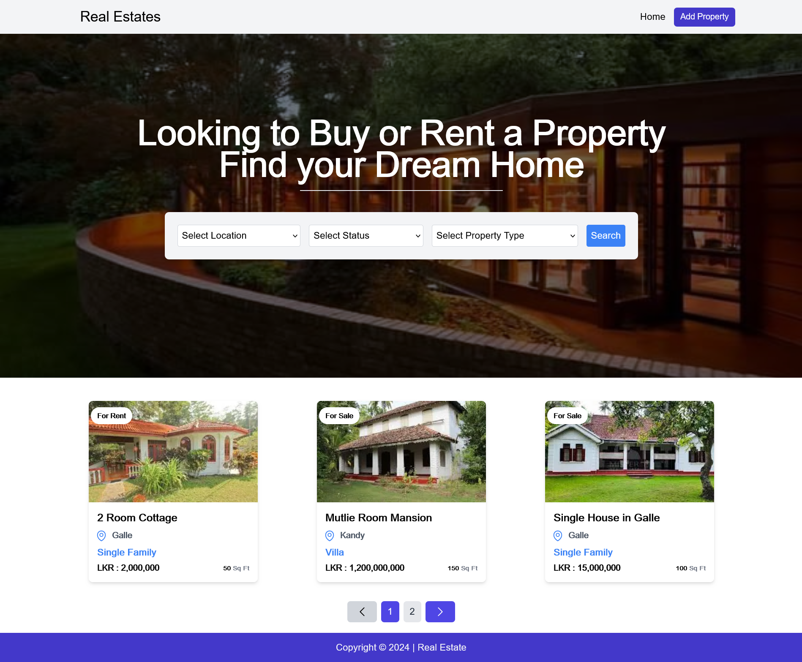

# Real Estate
Search  Properties and add new properties



## Prerequisites

## NPM
you need node js installed in order to run  If you dont have node goto the following link [Node](https://nodejs.org/en/download/package-manager/current) and download the latest version of node.


## Firebase Setup
You need to configure firebase and create a store to allow file uploads. after creating your file base app you need to 
add the keys to your .env.local file by creating .env.local file in your front-end folder. 

```bash
NEXT_PUBLIC_API_KEY = firebase_key
NEXT_PUBLIC_AUTH_DOMAIN = firebase_key
NEXT_PUBLIC_PROJECT_ID = firebase_key
NEXT_PUBLIC_STORAGE_BUCKET = firebase_key
NEXT_PUBLIC_MESSAGIN_SENDER_ID = firebase_key
NEXT_PUBLIC_APP_ID = firebase_key

```
## Mongo DB Setup (If using Atlas)


## 1. **Create a MongoDB Atlas Account**
- Go to [MongoDB Atlas](https://www.mongodb.com/cloud/atlas) and sign up for an account if you don't already have one.

## 2. **Create a Cluster**
1. Once you’re logged in, you’ll be directed to the Atlas dashboard.
2. Click on the **"Build a Cluster"** button.
3. Select your preferred **Cloud Provider** and **Region**.
4. Choose a **Cluster Tier**. The free tier is sufficient for development, so you can choose **M0 (Free Tier)**.
5. Click on **"Create Cluster"**. It will take a few minutes to create your cluster.

## 3. **Create a Database and Collection**
1. Once the cluster is created, go to your **Clusters** dashboard and click on the **"Collections"** button for your cluster.
2. You can either create a new database or use the default one. To create a new database: 
   - Click on the **"Create Database"** button.
   - Enter a name for your database (e.g., `propertyDB`) and an initial collection name (e.g., `properties`).
   - Click **"Create"**.

## 4. **Create a MongoDB User for Authentication**
1. In the Atlas dashboard, click on **"Database Access"** from the left sidebar.
2. Click **"Add New Database User"**.
3. Enter a **username** and **password** for your database user.
4. In the **Database User Privileges** section, select **"Read and write to any database"**.
5. Click **"Add User"** to create the user.

## 5. **Get the Connection String**
1. From the Atlas dashboard, go to **Clusters** and click on the **"Connect"** button for your cluster.
2. Select **"Connect your application"**.
3. Copy the **Connection String** provided. It will look like this:
   ```bash
   mongodb+srv://<username>:<password>@cluster0.mongodb.net/<dbname>?retryWrites=true&w=majority
4. Create a Variable in your .env file called MONGO_DB_URL and assign it to the String   

## If you have locally installed mongodb you can just use your connection string

## Get started

Open a terminal and clone this repo:

```bash
# Clone this repository
$ git clone https://github.com/Yehan20/properties

# Go into the repository
$ cd hardware-store

# Remove current origin repository
$ git remote remove origin

# If you want, you can add a new remote repository
$ git remote add origin https://github.com/<your-github-username>/<your-repo-name>.git
```


```bash
# Terminal for the server
# cd into the server folder
$ cd server

# Install dependencies
$ npm install. 

# Install nodemon if you don't have it
# You can either install it globally, or locally only for this project (remove the -g flag)
npm install nodemon -g

# run the server
$ npm run devStart
```

```bash
# Terminal for the client
# cd into the front-end folder
$ cd front-end

# Install dependencies
$ npm install

# run the client app
$ npm run dev
```

At this point, you will have the server running locally at http://localhost:3001, and the client app running in the browser at http://localhost:3000/ <br />

